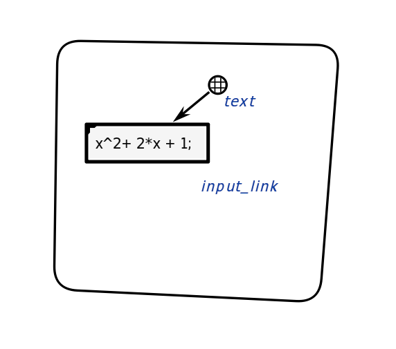
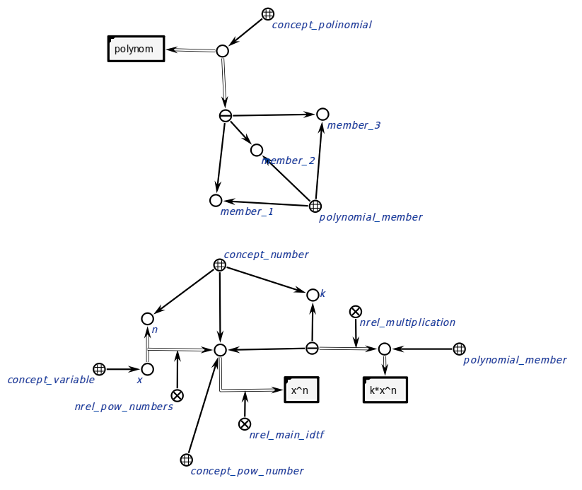
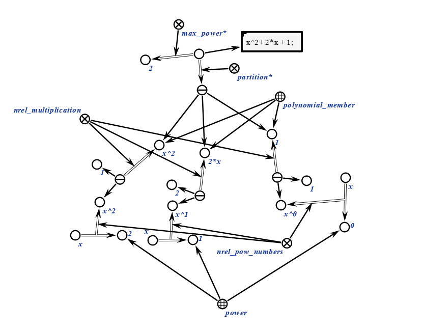

# Агент обрабатывающий входную ссылку

Этот агент получает ссылку на текстовый файл с выражением и транслирует ее в удобный для обработки формат.
**Класс действия:**
action_translation_math_expression_link
**Параметры:**
1. input_link — ссылка на выражение.
2. input_structure - входная структура.
**Рабочий процесс:**
- Агент загружает текстовый файл, извлекает коэффициенты и степени, преобразует в удобный формат.
### Пример
Пример входной структуры:
</img>
</img>
Пример выходной структуры:
</img>
### Результат
Возможные коды результата:
* `SC_RESULT_OK` — выходная кострукция сгенерирована;
* `SC_RESULT_ERROR` — внутренняя ошибка.