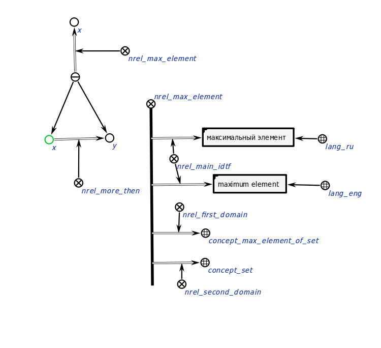
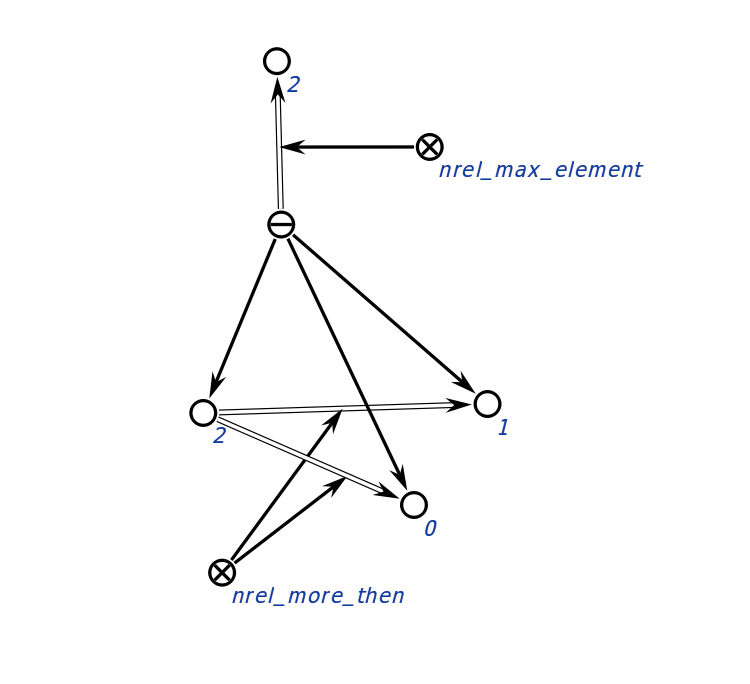

# Агент находящий максимальную степень
Этот агент сравнивает степени и находит максимальную.
**Класс действий:**
action_find_max_power
**Параметры:**
1. input_structure - входная структура.
**Рабочий процесс:**
- Агент сравнивает все степени, находя максимальный.
### Пример
Пример входной структуры 
</img>
Пример выходной структуры:
</img>
### Результат
Возможные коды результата:
* `SC_RESULT_OK` — выходная кострукция сгенерирована;
* `SC_RESULT_ERROR` — внутренняя ошибка.
