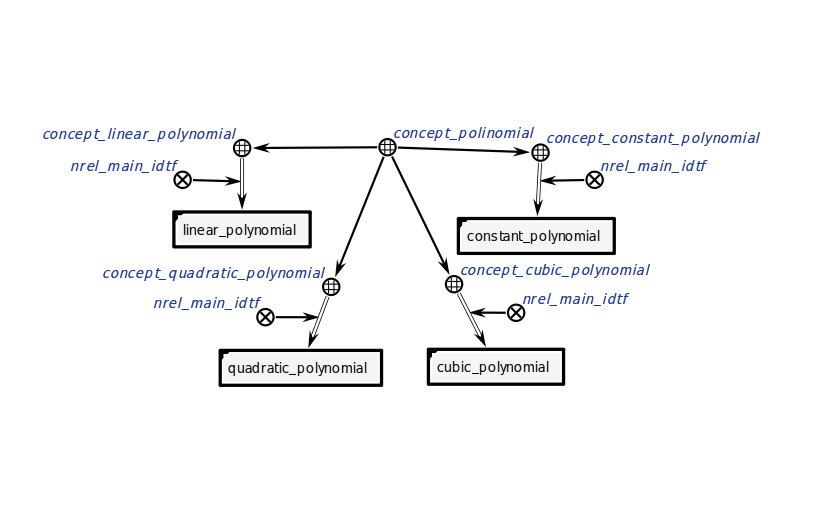
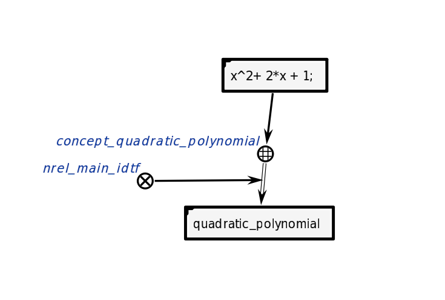

# Агент классифицирующий выражение
Этот агент делает вывод о типе выражения.
**Класс действия:**
action_classification_math_expression
**Параметры:**
1. rules_set - правила классификации.
2. input_structure - входная структура.
**Рабочий процесс:**
- Агент, пользуясь правилами классификации, делает вывод о типе выражения.
### Пример
Пример входной структуры 
</img>
Пример выходной структуры:
</img>
### Результат
Возможные коды результата:
* `SC_RESULT_OK` — выходная кострукция сгенерирована;
* `SC_RESULT_ERROR` — внутренняя ошибка.